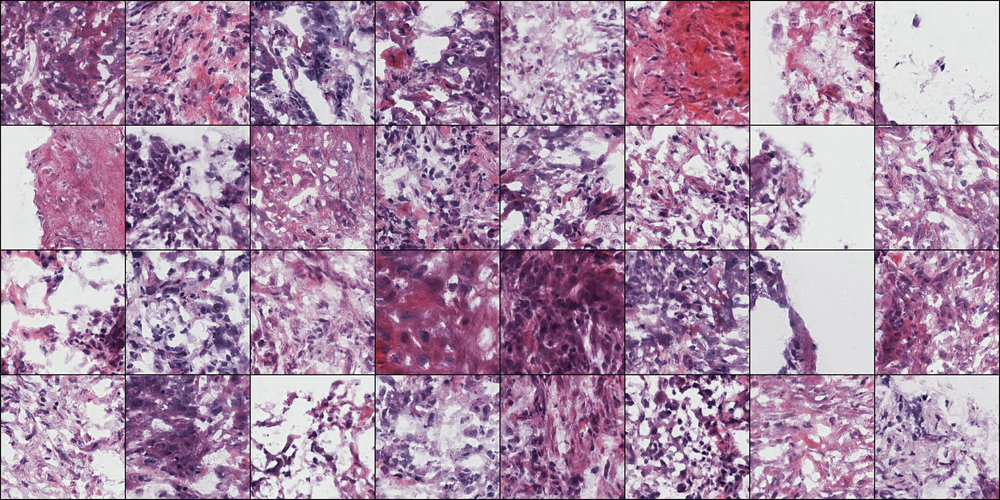

# Histology image generator using quantized autoencoder

## Usage

Sample histology images from a trained histology image model.

1. Download trained models into `checkpoint` folder.

```
cd checkpoint
wget http://ftp.mcs.anl.gov/pub/candle/public/benchmarks/Examples/histogen/histology.pt
wget http://ftp.mcs.anl.gov/pub/candle/public/benchmarks/Examples/histogen/top.pt
wget http://ftp.mcs.anl.gov/pub/candle/public/benchmarks/Examples/histogen/bottom.pt
```

2. Sample images.

```
python sample.py --batch=32 --top=top.pt --bottom=bottom.pt --vqvae=histology.pt sample32.jpg
```

This example generates 32 images (256px) combined into one output file.



## Model

The code is from a PyTorch implementation of VQ-VAE-2:

[Implementation of Generating Diverse High-Fidelity Images with VQ-VAE-2 in PyTorch](https://github.com/rosinality/vq-vae-2-pytorch)

## Training data

An example training data set of 81,378 histology images can be downloaded here:

```
wget http://ftp.mcs.anl.gov/pub/candle/public/benchmarks/Examples/histogen/svs_png.zip
```

## Requisite

- Python >= 3.6
- PyTorch >= 1.1
- lmdb (for storing extracted codes)

## Training

Currently supports 256px (top/bottom hierarchical prior)

1. Stage 1 (VQ-VAE)

> python train_vqvae.py [DATASET PATH]

If you use FFHQ, I highly recommends to preprocess images. (resize and convert to jpeg)

2. Extract codes for stage 2 training

> python extract_code.py --ckpt checkpoint/[VQ-VAE CHECKPOINT] --name [LMDB NAME] [DATASET PATH]

3. Stage 2 (PixelSNAIL)

> python train_pixelsnail.py [LMDB NAME]

Maybe it is better to use larger PixelSNAIL model. Currently model size is reduced due to GPU constraints.

train_vqvae.py and vqvae.py supports distributed training. You can use --n_gpu [NUM_GPUS] arguments for train_vqvae.py to use [NUM_GPUS] during training.
