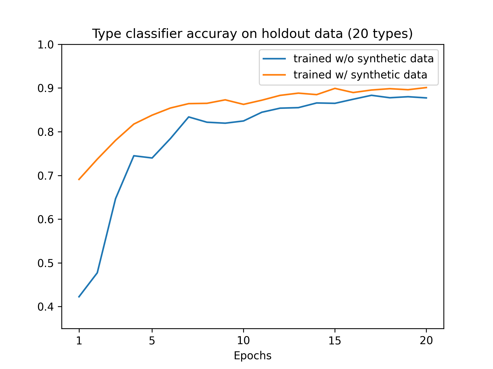

## Usage

The CANDLE-ized versions of the codes can simply be run without any command line arguments, with the default settings being read from the corresponding `default_model` file.
When needed, the CANDLE versions also use the `fetch_file` methods, which store the data in the top-level `Data/Examples` directory.
Any keywords in the `default_model` file can be overwritten with the appropriate command line argument.
The orginal codes and workflow below are preserved for comparison.
New package dependencies are now included in the top-level install instructions.

# CANDLE workflow

```
python rnagen_baseline_keras2.py
python rnagen_baseline_keras2.py --plot True
```

# Improving cancer type classifier with synthetic data

We demonstrate the value of generator models in boosting the performance of predictive models.
In this example, we first train a conditional variational autoencoder (CVAE) to learn the distribution of RNAseq data for cancer cell line samples. We then generate synthetic gene expression levels (of landmark genes defined by the [NIH LINCS1000 program](https://lincsproject.org/LINCS/tools/workflows/find-the-best-place-to-obtain-the-lincs-l1000-data)) by sampling from the latent representation along with a random type index. Adding the synthetic samples to the original training data, we hypothesize that a model trained under the otherwise same conditions would get enhanced performance. This is validated by our experiments in training a simple type classifier network and testing the classification accuracy on the holdout data not seen by the generator.




## Example 1

Training with 10,000 synthetic samples on the 10-type classification problem. 
```
python rnagen.py --top_k_types 10 --n_samples 10000
```

```
Train a type classifier:
Epoch 1/2
[==============================] - 0s 16ms/step - loss: 2.1176 - accuracy: 0.2756 - val_loss: 1.8421 - val_accuracy: 0.2835
Epoch 2/2
[==============================] - 0s 4ms/step - loss: 1.6457 - accuracy: 0.5947 - val_loss: 1.3630 - val_accuracy: 0.7664

Evaluate on test data:
[==============================] - 0s 2ms/step - loss: 1.3624 - accuracy: 0.7679

Train conditional autoencoder:
Epoch 1/20
27/27 [==============================] - 0s 15ms/step - loss: 0.9212 - kl: 0.2417 - xent: 0.6775 - mse: 0.0210 - corr: 0.5072 - val_loss: 0.6825 - val_kl: 0.0191 - val_xent: 0.6634 - val_mse: 0.0144 - val_corr: 0.7024
Epoch 2/20
27/27 [==============================] - 0s 6ms/step - loss: 0.6720 - kl: 0.0107 - xent: 0.6613 - mse: 0.0134 - corr: 0.7228 - val_loss: 0.6661 - val_kl: 0.0067 - val_xent: 0.6594 - val_mse: 0.0128 - val_corr: 0.7385
...
Epoch 19/20
27/27 [==============================] - 0s 6ms/step - loss: 0.6533 - kl: 0.0013 - xent: 0.6520 - mse: 0.0094 - corr: 0.8156 - val_loss: 0.6530 - val_kl: 0.0014 - val_xent: 0.6517 - val_mse: 0.0094 - val_corr: 0.8152
Epoch 20/20
27/27 [==============================] - 0s 6ms/step - loss: 0.6532 - kl: 0.0013 - xent: 0.6520 - mse: 0.0094 - corr: 0.8151 - val_loss: 0.6530 - val_kl: 0.0013 - val_xent: 0.6517 - val_mse: 0.0094 - val_corr: 0.8149

Generate 10000 RNAseq samples:
Done in 0.212 seconds (47255.2 samples/s).

Train a type classifier with synthetic data:
3806 + 10000 = 13806 samples
Epoch 1/2
49/49 [==============================] - 0s 5ms/step - loss: 1.6122 - accuracy: 0.6193 - val_loss: 0.8120 - val_accuracy: 0.9435
Epoch 2/2
49/49 [==============================] - 0s 3ms/step - loss: 0.4497 - accuracy: 0.9515 - val_loss: 0.2579 - val_accuracy: 0.9580

Evaluate again on original test data:
[==============================] - 0s 2ms/step - loss: 0.5237 - accuracy: 0.8583
Test accuracy change: +11.77% (0.7679 -> 0.8583)
```

## Example 2:

Compare and plot model performance. 

```
python rnagen.py --plot
```

```
...

Plot test accuracy using models trained with and without synthetic data:
training time: before vs after
# epochs = 1: 0.4224 vs 0.6909
# epochs = 2: 0.4772 vs 0.7372
# epochs = 3: 0.6468 vs 0.7802
# epochs = 4: 0.7450 vs 0.8175
# epochs = 5: 0.7399 vs 0.8379
# epochs = 6: 0.7843 vs 0.8542
# epochs = 7: 0.8338 vs 0.8642
# epochs = 8: 0.8217 vs 0.8649
# epochs = 9: 0.8195 vs 0.8729
# epochs = 10: 0.8246 vs 0.8625
# epochs = 11: 0.8445 vs 0.8721
# epochs = 12: 0.8539 vs 0.8831
# epochs = 13: 0.8551 vs 0.8882
# epochs = 14: 0.8658 vs 0.8848
# epochs = 15: 0.8649 vs 0.8991
# epochs = 16: 0.8743 vs 0.8896
# epochs = 17: 0.8833 vs 0.8954
# epochs = 18: 0.8777 vs 0.8984
# epochs = 19: 0.8801 vs 0.8961
# epochs = 20: 0.8773 vs 0.9010
```
